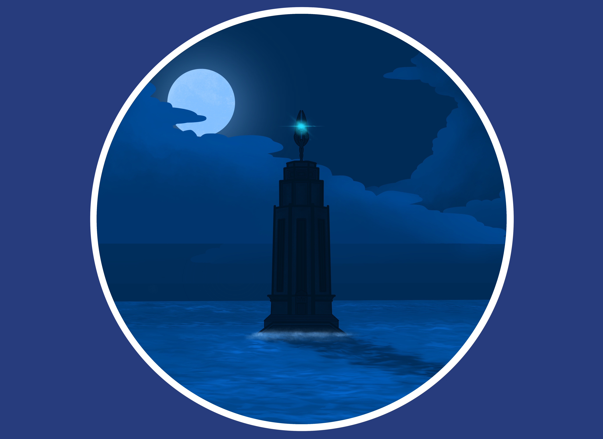

<html>
<body style="background-color:blue;">
<h1>About me:</h1>  
<h1>I like to create work that give the viewer nostalgic feelings of the simpler times in their life. I do this by incorporating retro music and visuals into my pieces - typically from the early 2000's to the late 80's. I enjoy tackling and exploring the themes of memory and tranquility as well. For my videos specifically, there is a focus on "meditative" themes as well as an overall cinematic experience.
  
My interests as an artist are in the digital field: Modeling, Game art and development, and cinematics. My inspirations for my artwork come from my own childhood and from my strong interest in science fiction and technology. People familiar with my inspirations (Halo, Alien, and Star Wars) will see the concepts and design clearly in my artwork.</h1>  
<h1>Digital Art</h1>  
  
  
  
  
  
<h1>Digital Video Projects</h1>  
<iframe src="https://player.vimeo.com/video/362677037" width="640" height="564" frameborder="0" allow="autoplay; fullscreen" allowfullscreen></iframe>
<iframe src="https://player.vimeo.com/video/374735891" width="640" height="564" frameborder="0" allow="autoplay; fullscreen" allowfullscreen></iframe>
<iframe src="https://player.vimeo.com/video/403043922" width="640" height="564" frameborder="0" allow="autoplay; fullscreen" allowfullscreen></iframe>
<h1>Photography</h1>  
  
  
  
<h1>Physical Art</h1>  
  
  
  
</html>
